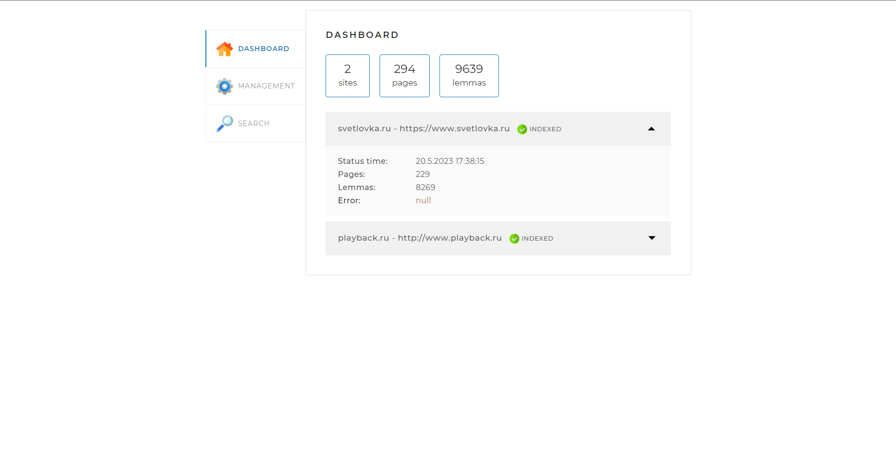
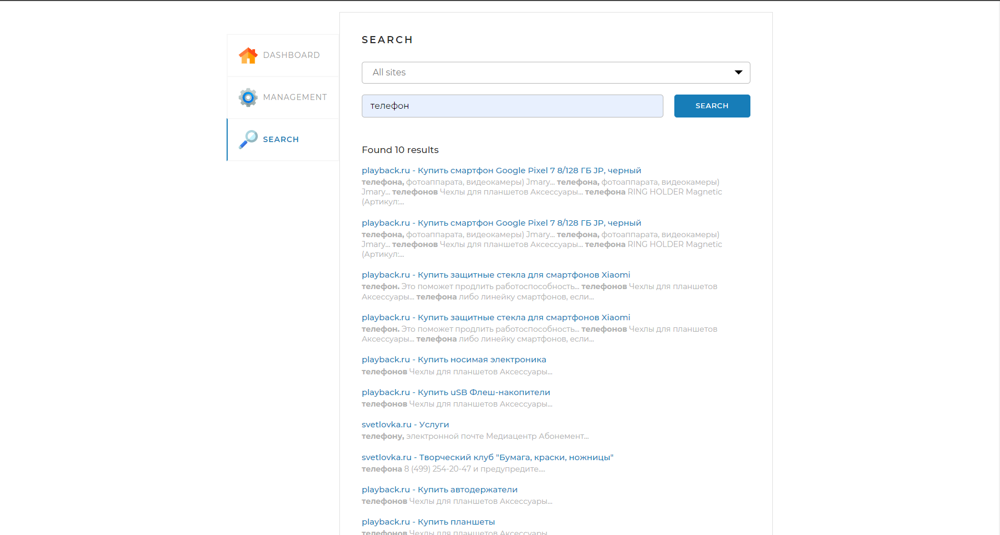

# Searchengine
Данный проект реализует поисковый движок, предоставляющий пользователю специальный API со следующими основными функциями:
<li>индексирование сайтов;</li>
<li>выдача основных сведений по сайтам;</li>
<li>поиск ключевых слов в проиндексированных сайтах и предоставление их пользователю.</li>

## Функции движка

В проект входит веб-страница, которая позволяет управлять процессами движка,
для того чтобы на нее попасть нужно предварительно:
<li>установить СУБД;</li>
<li>cоздать пользователя СУБД с паролем <i>8-0CytDgh!</i>, 
или же ввести свой пароль в файле <i>application.yaml</i>;</li>
<li>в базе данных создать схему search_engine;</li>
<li>скомпилировать проект с помощью класса Application;</li>
<li>ввести в браузере http://localhost:8080/;</li>

Страница содержит три вкладки.

### Вкладка DASHBOARD

Эта вкладка открывается по стандарту. На ней
отображается статистика по всем проиндексированным сайтам, 
в ней же можно посмотреть статистику по каждому сайту отдельно.

### Вкладка MANAGEMENT

На этой вкладке находятся инструменты управления 
поисковым движком — запуск и остановка индексации,
а также возможность обновить отдельную страницу по ссылке 

### Вкладка SEARCH

Здесь находится поле поиска а так же возможность выбрать сайт для поиска в выпадающем списке,
по которому нужно будет провести поиск, а после нажатия кнопки
<i>SEARCH</i> выводятся результаты поиска.

## Используемые технологии
Spring Framework, JPA, JSOUP, SQL, Morphology Library Lucene